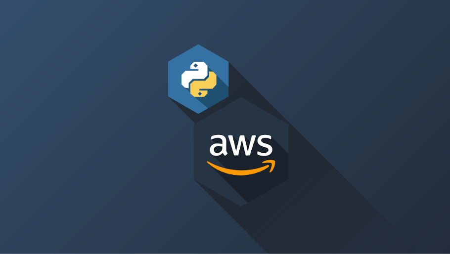

# AWSRestart-PythonLab

> **AWSRestart-PythonLab** es una colección de códigos en Python diseñados específicamente para el programa AWS Restart. Este repositorio contiene 13 archivos `.py`, cada uno correspondiente a un laboratorio práctico del programa, centrado en la enseñanza y aplicación de Python en el entorno de la nube de AWS.

### Requisitos Previos

- Acceso a la consola de administración de AWS.
- Instalación de Python 3.x.

### Instrucciones de Uso

- No es necesario instalar nada, ya que cada laboratorio es un archivo .py independiente.
- Puedes ejecutar los archivos en Cloud9, VScode u otro entorno de desarrollo Python.

## 📝 Licencia

Este proyecto no está sujeto a ninguna licencia específica. Puedes usar, modificar y distribuir el código según tus necesidades.

